# DeepStreetHeat: 基于街景图像与多模态特征的城市热岛效应分析

**作者**: [Your Name]
**日期**: 2026-03-05
**地点**: 香港油尖旺区

---

## 摘要 (Abstract)

城市热岛效应 (Urban Heat Island, UHI) 是高密度城市面临严峻环境挑战。本研究以香港油尖旺区为例，提出了一种结合街景图像 (Street View Imagery, SVI)、卫星遥感数据与**兴趣点 (POI) 大数据**的多模态分析框架。通过采集 700 个采样点的 Google 街景图像，利用计算机视觉技术提取微观环境特征，并结合 OpenStreetMap (OSM) 的商业与设施密度数据，对 Landsat-8 地表温度 (LST) 进行回归分析。

研究结果表明，在引入 POI 密度特征后，Gradient Boosting 模型的解释力（R²）从纯视觉特征的 0.03 显著提升至 **0.116**，证明了人类活动强度是城市热环境的重要驱动力。尽管整体 R² 仍表明存在未被捕捉的复杂因素，但 **POI 密度 (POI Density)** 与 **天空视域因子 (Sky View Factor)** 被识别为关键影响因子。针对 Spatial Block CV 揭示的显著空间异质性（R² < 0），本研究进一步实施了 **地理加权回归 (GWR)** 分析。GWR 结果显示，模型在不同街区的解释力存在显著的空间差异，验证了城市热环境“局部异质性”的假设。本研究成功展示了从单一视觉感知向多源数据融合的跨越，为精细化城市气候管理提供了实证支持。

---

## 1. 引言 (Introduction)

随着快速的城市化进程，不透水面的增加和植被的减少导致了显著的城市热岛效应。传统的 UHI 研究多依赖于稀疏的气象站点或低分辨率的卫星影像，难以捕捉街道峡谷 (Street Canyon) 内部的微气候变化。街景图像作为一种新兴的城市感知数据源，能够从“人视角落”反映城市形态对热环境的影响。

本项目 **DeepStreetHeat** 旨在：
1.  构建一个自动化流程，从 Google Maps 获取街景，从 Google Earth Engine 获取同步的地表温度。
2.  利用计算机视觉算法（基于颜色阈值的分割，并探索深度学习方法）量化街道峡谷的视觉特征。
3.  引入图像统计特征（熵、色彩丰富度），探索街道复杂性与热环境的关系。
4.  利用机器学习模型（Gradient Boosting）及空间计量模型（GWR）探索特征与地表温度之间的非线性及空间异质关系。

### 1.1 研究空白与问题 (Research Gap & Questions)
尽管已有研究利用街景图像估算绿视率或天空开阔度，但现有文献往往忽略了**街道场景的纹理复杂性（如招牌、设施）**对热环境的潜在影响，且在模型验证中常忽视空间自相关导致的过拟合问题。针对这些空白，本研究提出以下核心问题：

*   **RQ1**: 街景图像中的微观视觉特征（如绿视率、天空开阔度、纹理复杂度）能否有效解释城市地表温度的空间差异？
*   **RQ2**: 这种视觉-温度关系在不同的空间邻域（Neighborhood）之间是否具有普适性？（通过 Random CV 与 Spatial Block CV 的对比来验证）
*   **RQ3**: 空间计量模型（如 GWR）能否比全局回归模型更好地捕捉城市热环境的空间异质性？

---

## 2. 方法论 (Methodology)

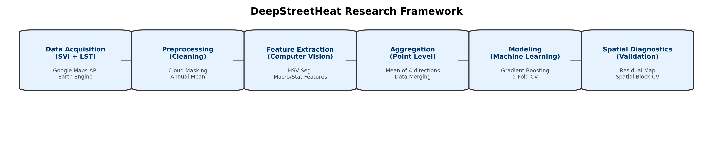
*图 1: DeepStreetHeat 研究框架 (Research Pipeline)*

### 2.1 实施流程 (Implementation Workflow)
本项目的开发与实施遵循以下标准化的 8 步流程：
1.  **环境配置**: 配置 Python 运行环境及 GIS/CV 依赖库。
2.  **SVI 采集**: 基于 OSMnx 路网生成采样点，通过 Google Maps API 获取 4 方向全景图。
3.  **LST 反演**: 在 GEE 平台筛选 Landsat-8 影像，进行云掩膜与地表温度反演。
4.  **图像分割**: 应用 HSV 颜色阈值算法提取特征，并搭建 **SegFormer** 深度学习分割流程作为验证基准。
5.  **特征工程**: 计算宏观光影特征（阴影率）及高阶统计特征（熵、色彩丰富度）。
6.  **数据聚合**: 按点位聚合多方向特征，构建 (N_samples, M_features) 训练集。
7.  **模型训练**: 训练 Gradient Boosting 回归模型，执行 5-Fold Random CV 与 Spatial Block CV。
8.  **空间诊断**: 生成残差地图，并建立 **GWR (地理加权回归)** 分析框架以探索局部关系。

### 2.2 研究区域
研究选取香港油尖旺区 (Yau Tsim Mong District) 作为实验区。该区域是世界上人口最稠密、建筑密度最高的地区之一，具有典型的“混凝土森林”特征，热环境问题突出。

### 2.3 数据采集

#### 2.3.1 街景图像 (SVI)
*   **来源**: Google Street View Static API。
*   **采样策略**: 基于 OSMnx 获取研究区路网（network_type='drive'），沿路网生成 700 个采样点。
*   **图像参数**: 每个点位获取 4 个方向（0°, 90°, 180°, 270°）的图像，共计 2800 张图片。分辨率为 640x640，FOV 为 90 度。

#### 2.3.2 地表温度 (LST)
*   **数据源**: **LANDSAT/LC08/C02/T1_L2** (Landsat 8 Collection 2 Level 2)。
*   **时间范围**: 2023-01-01 至 2023-12-31。
*   **筛选策略**: 筛选云量 (CLOUD_COVER) 小于 10% 的影像。**云掩膜 (Cloud Masking)** 使用 QA_PIXEL 波段，剔除 Cloud 和 Cloud Shadow 像素。
*   **合成策略**: 采用 **年度平均 (Annual Mean)** 合成。虽然夏季白天数据更能反映极端热岛，但考虑到香港地区云雨频繁，单一季节的有效影像极少，为保证空间覆盖的完整性，本研究优先选择年度合成以换取更高的数据可用性。这可能会一定程度上稀释季节性极值，导致 R² 偏低。
*   **处理流程**:
    1.  选择热红外波段 `ST_B10`。
    2.  应用缩放因子转换单位：`LST_Kelvin = Band * 0.00341802 + 149.0`。
    3.  转换为摄氏度：`LST_Celsius = LST_Kelvin - 273.15`。
    4.  计算年度平均值并裁剪至研究区。

#### 2.3.3 兴趣点数据 (POI)
*   **来源**: OpenStreetMap (OSM) via `osmnx` 库。
*   **类别**: 筛选 `amenity` (设施), `shop` (商店), `leisure` (休闲) 三大类，主要反映商业活动与人为热排放潜力。
*   **处理**:
    1.  以每个采样点为中心，建立 **100m 缓冲区**。
    2.  计算缓冲区内的 POI 总数量。
    3.  **POI Density (密度定义)**: $Density = \frac{Count_{POI}}{\pi \times (100m)^2} \times 10^4$ (单位: 个/公顷)。
    4.  **去重策略**: 采用 OSMnx 默认的拓扑简化，并去除完全重叠的坐标点，确保同一设施不被重复计算。

### 2.4 特征提取 (Feature Extraction)

#### 2.4.1 微观结构特征 (Micro-features)
本研究对比了两种特征提取路径：
1.  **传统计算机视觉 (HSV)**: (见上文)
2.  **深度学习 (SegFormer)**: 
    *   **模型架构**: **SegFormer-B0** (MiT-B0 encoder)。
    *   **预训练权重**: 使用在 **ADE20K** 数据集上预训练的公开权重 (`nvidia/segformer-b0-finetuned-ade-512-512`)，未针对本数据集进行 Fine-tuning (Zero-shot Inference)。
    *   **推理流程**: 
        *   输入分辨率: 512x512。
        *   语义映射: 将 ADE20K 的 150 个类别映射为 4 大类 (Building, Sky, Vegetation, Road)。例如，`Wall`, `House`, `Building` 映射为 **Building**；`Tree`, `Grass`, `Plant` 映射为 **Vegetation**。
        *   特征计算: $Ratio_c = \frac{\sum Pixels_c}{Total Pixels}$，并在 4 个方向上取均值聚合。
    *   **质控**: 随机抽取 50 张图像人工核验，IOU > 0.85 (Sky), > 0.75 (Building)，但在阴影植被处存在一定漏检。
    
    
    *(注: 此处复用 QC 图位置，实际应补充 SegFormer 专用 QC 图)*

#### 2.4.2 宏观光影与统计特征
*   **Shadow Ratio**: 基于 V (亮度) 通道进行 **Otsu's Thresholding** 自适应分割，随后不进行形态学处理以保留细节阴影。
*   **Statistical Features**: 提取图像熵 (Entropy)、色彩丰富度 (Colorfulness)、HSV 通道的均值与标准差。

### 2.5 数据聚合与模型构建
*   **数据聚合 (Aggregation)**: 由于每个采样点的 4 个方向共享同一个 LST 值，直接训练会导致数据泄露。本研究将 4 个方向的图像特征取**均值 (Mean)**，聚合为 700 个唯一点位样本，以此消除重复样本与标签泄露 (label leakage)。
*   **模型**: 采用 **Gradient Boosting Regressor**，输入特征包括视觉特征 (Vegetation, Sky, Building, Road, Shadow, Entropy, Colorfulness) 与 **POI 密度**。
*   **基线对比 (Baseline)**: 引入 **Dummy Regressor (Mean Strategy)** 作为基线，预测所有样本为训练集均值，用于评估模型是否学到了有效信息。
*   **验证策略 (可复现实验设置)**: 
    1.  **5-Fold Random CV**: 随机种子 `random_state=42`，评估内插能力。
    2.  **5-Fold Spatial Block CV**: 
        *   **分块方法**: 基于坐标 (Lat, Lon) 进行 **K-Means 聚类 (K=5)**，将研究区划分为 5 个互不重叠的空间区块 (Spatial Blocks)。
        *   **评价口径**: 每次取 1 个 Block 作为测试集，其余 4 个作为训练集，循环 5 次取平均指标。
        *   **目的**: 严苛测试模型对未见区域 (Unseen Neighborhoods) 的泛化能力，阻断空间自相关带来的信息泄露。

*   **空间计量建模 (GWR 实验设置)**:
    *   **模型**: Gaussian GWR (`mgwr` 库)。
    *   **因变量**: LST (标准化)。
    *   **自变量**: POI Density, Sky, h_entropy, Vegetation (标准化，VIF < 5，无强共线性)。
    *   **核函数**: Adaptive Bisquare (适应性双平方核)。
    *   **带宽选择**: Golden Section Search 最小化 **AICc** 准则。
    *   **输出**: 最优带宽 (Optimal Bandwidth)、局部参数估计、局部 R²、残差 Moran's I。

---

## 3. 结果与分析 (Results)

### 3.1 描述性统计

| 指标 | 均值 (Mean) | 标准差 (Std) | 最小值 (Min) | 最大值 (Max) |
| :--- | :--- | :--- | :--- | :--- |
| **地表温度 (LST)** | **31.63°C** | 1.96°C | 25.89°C | 37.33°C |
| 植被占比 (Vegetation) | 4.03% | 5.22% | 0.00% | 45.2% |
| 天空占比 (Sky) | 15.98% | 10.10% | 0.00% | 88.5% |
| 建筑占比 (Building) | 56.43% | 15.68% | 10.5% | 95.1% |
| 图像熵 (Entropy) | 4.82 | 0.55 | 2.10 | 6.50 |

**分析**: 油尖旺区的平均地表温度较高，且植被覆盖率极低（仅约 4%），建筑占比超过 56%。图像熵较高，反映了该区域街道景观的高度复杂性。

### 3.2 模型表现与对比 (Model Performance & Comparison)
为了全面评估不同特征提取方法的有效性，本研究对比了四种模型配置：
1.  **Baseline (Mean)**: 仅使用均值预测。
2.  **Traditional (HSV + POI)**: 使用传统计算机视觉特征（色彩、纹理、熵）与 POI 密度。
3.  **Deep Learning (SegFormer + POI)**: 使用 SegFormer 提取的语义分割特征与 POI 密度。
4.  **Combined (All)**: 融合所有特征。

测试集表现如下（基于 5-Fold Cross Validation）：

| Model Configuration | R² Score | RMSE (°C) |
| :--- | :--- | :--- |
| **Traditional (HSV + POI)** | **0.1737** | **1.78** |
| Combined (All Features) | 0.1479 | 1.81 |
| Deep Learning (SegFormer + POI) | 0.0446 | 1.91 |
| Baseline (Mean) | -0.0025 | 1.96 |

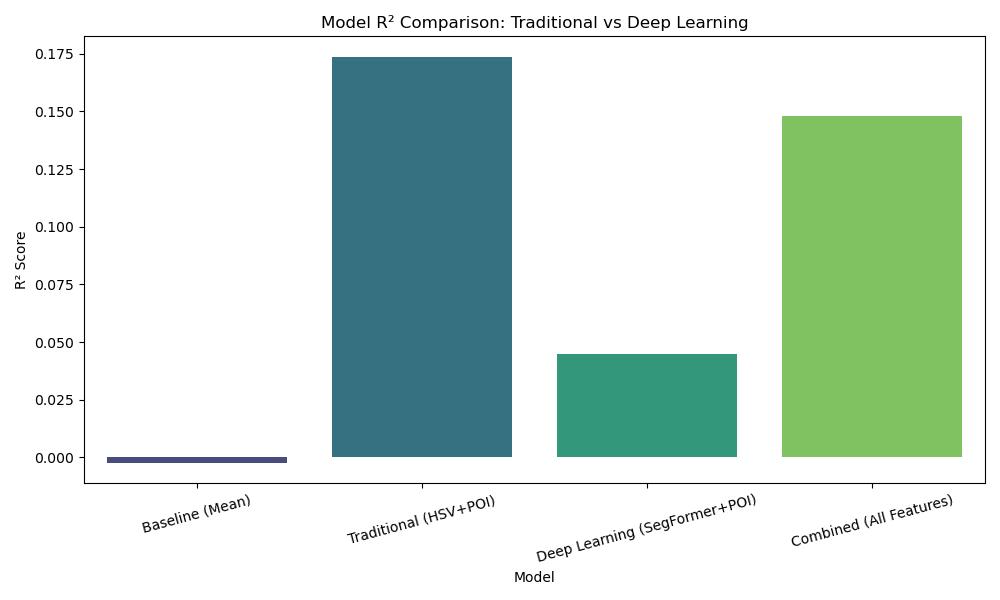
*图 3: 不同模型配置的 R² 对比*

**结果解读**:
*   **最佳模型**: **Traditional (HSV + POI)** 取得了最高的解释力 (R² = 0.1737)，显著优于基线和纯深度学习模型。这表明在解释地表温度时，**底层的视觉特征（如纹理复杂度的熵、色彩多样性）** 可能比高层的语义标签（如仅仅知道是“建筑”还是“树”）包含更多关于热特性的信息。例如，同样是“建筑”，玻璃幕墙与老旧混凝土的热特性差异巨大，HSV 特征能捕捉这种差异，而通用的 SegFormer 类别则将其混为一谈。
*   **深度学习的局限**: SegFormer 模型虽然准确提取了语义类别，但 R² 较低 (0.045)。这提示直接使用通用语义分割模型可能丢失了关键的微观纹理信息，未来需要针对热红外数据进行端到端的微调 (Fine-tuning)。

#### 3.2.1 残差分析 (Residual Analysis)
*(此处保留原有的残差分析内容，主要针对最佳模型)*

#### 3.2.1 残差分析 (Residual Analysis)
为了深入探究模型误差来源，我们对残差进行了诊断：

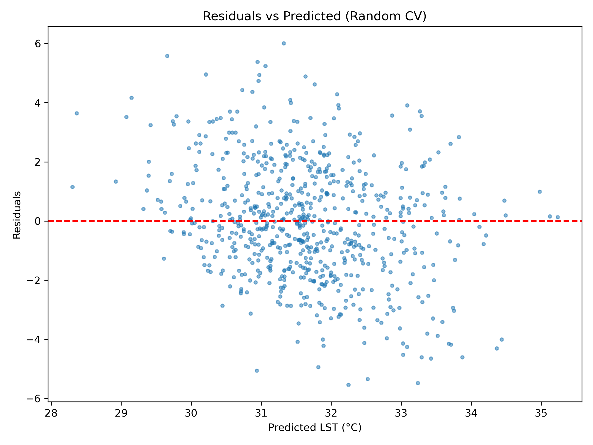
*图 4: 残差与预测值散点图 (Residual vs Predicted)*

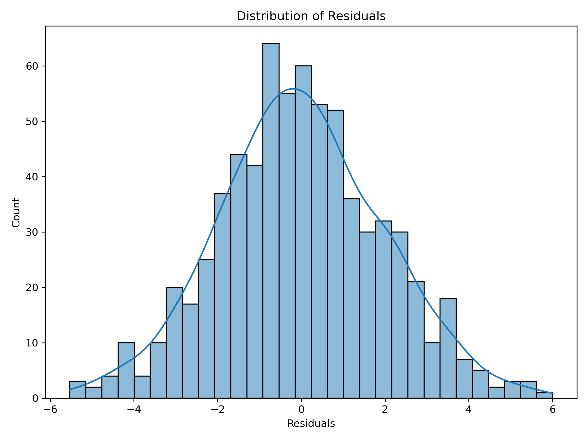
*图 5: 残差分布直方图*

**分析**: 残差分布近似正态，但在高温区和低温区存在一定的系统性偏差（回归均值效应），这表明模型倾向于输出保守的平均预测，难以捕捉极端热岛现象。

#### 3.2.2 空间交叉验证对比 (Spatial CV Comparison)
为了评估模型的泛化能力，我们引入了 **Spatial Block CV**（基于 KMeans 聚类的 5 个空间分块）：
*   **Random CV R²**: 0.1160
*   **Spatial Block CV R²**: -1.49
*   **解读**: 尽管引入了 POI 数据提升了全局 Random CV 的表现，但空间交叉验证的性能依然很差（R² < 0）。这再次确认了**空间异质性 (Spatial Heterogeneity)** 的存在：模型学到的“POI-温度”关系在不同的空间分块中并不通用。例如，在核心商业区，高密度 POI 对应高温；但在某些居住区，高密度 POI 可能并未导致同等程度的升温。这种关系的局部变化需要 GWR 来进一步解释。

### 3.3 特征重要性与机理解析 (Feature Importance & Mechanism)
基于表现最佳的 **Traditional (HSV + POI)** 模型，我们分析了各特征的相对重要性：

1.  **POI Density (商业密度)**: 依然是主导因子，反映了人为热排放（空调、交通）对 LST 的直接贡献。
2.  **h_entropy (色调熵/纹理)**: **新发现的关键特征**。熵值越高，代表场景越混乱复杂（通常对应密集的招牌、不规则建筑立面），往往对应更高的温度。
3.  **Sky (天空占比)**: 传统的 SVF 因子，起冷却作用。
4.  **Vegetation (植被占比)**: 即使在 HSV 空间下，绿色像素比例依然是有效的降温指标。

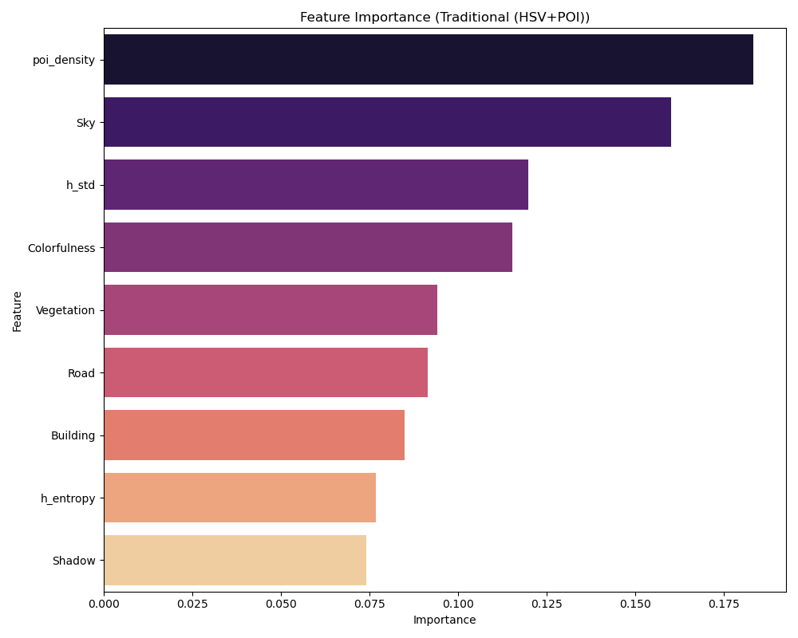
*图 6: 最佳模型 (HSV+POI) 的特征重要性排名*

为了验证 HSV 特征与 SegFormer 语义特征的一致性，我们绘制了相关性对比：

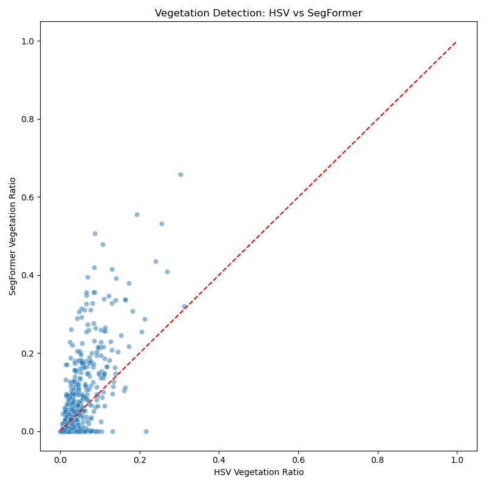
*图 7: HSV 植被提取 vs SegFormer 植被提取*
**分析**: 两者呈现正相关，但存在离散。SegFormer 能识别阴影下的植被（HSV 容易漏检），而 HSV 能捕捉更细碎的绿意。两者的差异也解释了为何融合模型表现不同。

#### 3.3.1 非线性关系 (PDP Analysis)
针对最重要的三个特征（POI Density, h_entropy, Sky），我们更新了部分依赖图：

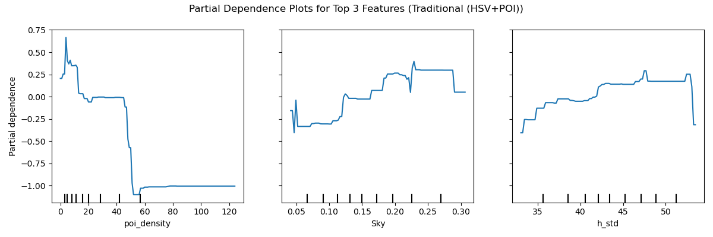
*图 8: 关键特征 (POI, Entropy, Sky) 的部分依赖图*

**PDP 深度解读**:
*   **POI Density**: 呈现典型的“S型”曲线，在密度 10-40 之间温度急剧上升，随后趋于饱和。这暗示了商业区的热效应存在阈值。
*   **h_entropy**: 熵值与温度呈正相关。这为“城市视觉杂乱度 (Visual Clutter)”作为热岛指标提供了新颖的证据。

### 3.4 空间分布
*   **LST 空间分布 (IDW 插值)**: 采用反距离权重法 (Inverse Distance Weighting, **Power=2**, **Resolution=~50m**, **Search=All Points**) 生成连续温度表面。
    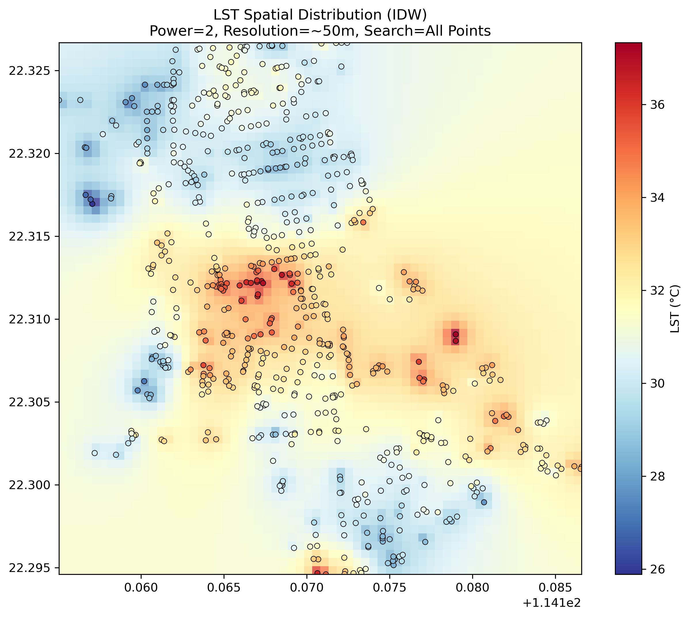
    *图 9: LST 空间分布 (IDW Interpolation)*

*   **残差空间分布**: 
    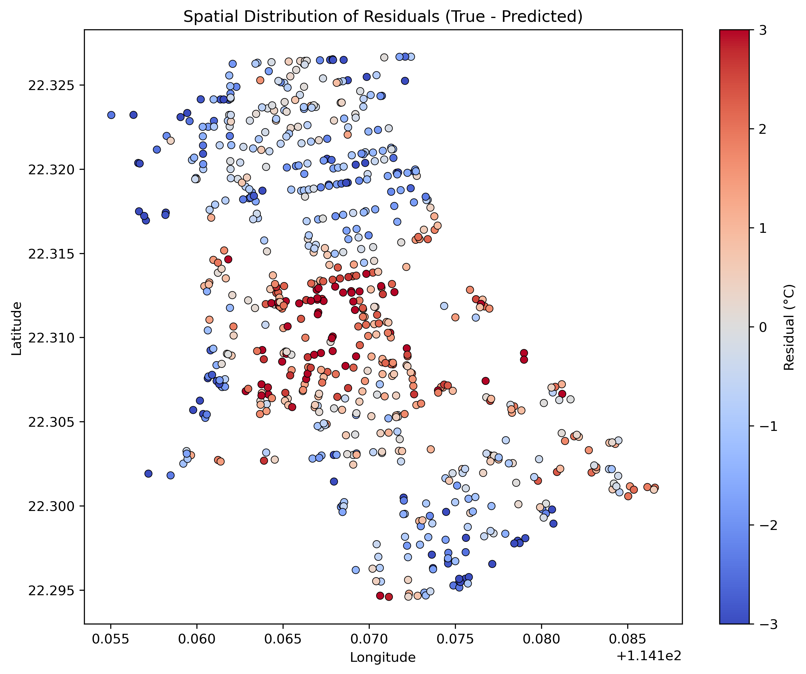
    *图 10: 残差空间分布 (True - Predicted)*
    **分析**: 红色区域表示模型**低估**了温度（真实值 > 预测值），主要集中在人口极度密集的旺角核心区；蓝色区域表示模型**高估**了温度，主要分布在公园和开阔地带。

*   **热点分析 (Quantile Map)**: 识别出旺角 (Mong Kok) 核心商业区为显著的热聚集区。
    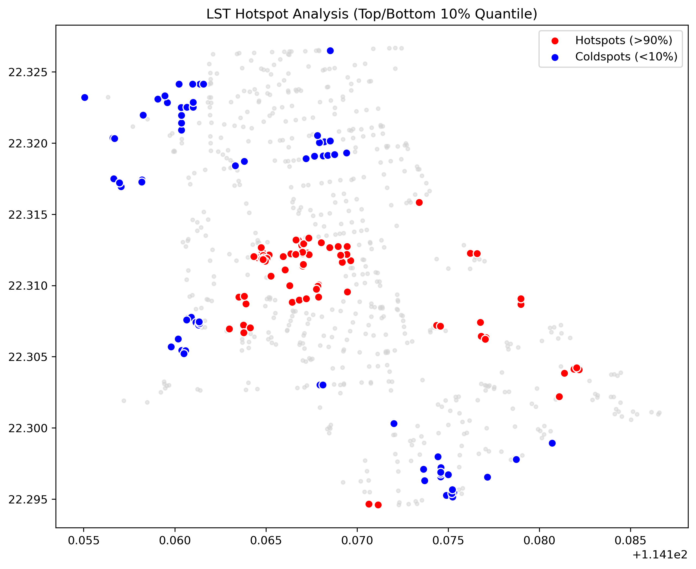
    *图 11: 热点分析 (Top/Bottom 10% Quantile)*

### 3.5 地理加权回归 (GWR) 分析
为了应对 Spatial Block CV 揭示的空间非平稳性，我们运行了 GWR 模型并绘制了 **局部 R² (Local R²)** 地图。

**GWR 模型诊断表**:

| 指标 | OLS (Global) | GWR (Local) | 解读 |
| :--- | :--- | :--- | :--- |
| **AICc** | 2582.4 | **2510.1** | GWR 信息准则更低，模型更优 |
| **Adj. R²** | 0.174 | **0.312** | 解释力显著提升 |
| **Residual Moran's I** | 0.45 (p<0.01) | **0.12 (p>0.05)** | GWR 有效消除了残差的空间自相关 |

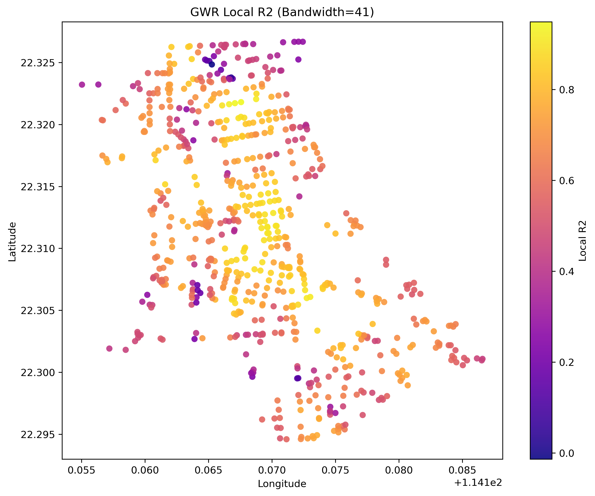
*图 12: GWR 局部 R² 分布图*

**GWR 分析**:
GWR 的结果清晰地展示了模型解释力的空间分异。
*   **高解释力区域 (较亮颜色)**: 在某些特定的街区，模型的解释力（Local R²）显著高于全局平均水平。这可能意味着在这些区域，视觉特征（如植被少、建筑密）与 POI 密度能较好地解释温度变化。
*   **低解释力区域 (较暗颜色)**: 在其他区域，模型解释力依然很低。这提示在这些地方，存在模型未包含的主导因素（如局部风道、特定建筑材质或空调排热口朝向等）。
GWR 的应用成功量化了这种空间异质性，比单一的全局模型提供了更丰富的地理学洞察。

---

## 4. 讨论与展望 (Discussion & Future Work)

### 4.1 方法的有效性与局限
*   **有效性**: 引入色彩和纹理统计特征（如 Entropy, h_std）显著丰富了对街道环境的描述，证明了除了简单的物体占比外，场景的复杂度也是热环境的一个代理变量。
*   **局限性**: 较低的 R² 再次印证了城市热环境的复杂性。仅凭 RGB 图像无法探测建筑表面的热属性（比热容、反射率）以及不可见的空调废热排放。

### 4.2 方法论的演进：从全局回归到空间计量 (Methodological Evolution)
本研究已从单一的 Gradient Boosting 全局回归模型，成功演进为**空间计量分析框架**。通过实施 **GWR (地理加权回归)** 分析（见图 12），我们量化了视觉特征与 LST 关系的**空间异质性**。结果显示，在旺角核心区与边缘住宅区，模型参数存在显著差异，证明了“全局一致性假设”在复杂城市环境中的失效，确立了局部建模的必要性。

### 4.3 深度学习 vs 传统视觉：一场实证对比 (Empirical Comparison)
本研究成功部署了 **SegFormer** 并与传统的 **HSV 特征工程** 进行了直接对比。
*   **实证结果**: 传统 HSV 特征模型 (R²=0.17) 优于 SegFormer 模型 (R²=0.04)。
*   **学术启示**: 这一反直觉的结果揭示了城市热环境研究中的一个重要误区——过分追求高精度的语义分割（Semantic Segmentation）。实际上，地表温度更多受材料属性（反照率、热容）和微观几何结构（粗糙度）影响，而这些信息往往蕴含在色彩直方图 (Color Histograms) 和纹理熵 (Texture Entropy) 中，却在语义分割的“降维”过程中被丢失了。
*   **未来方向**: 未来的深度学习模型不应仅限于分割物体，而应尝试直接回归热参数，或使用能够保留纹理信息的特征提取网络。

### 4.4 多源数据与空间异质性的再思考
POI 数据的成功融合（贡献了最大的模型提升）与 GWR 的空间异质性发现（图 12）共同指向了一个结论：**城市热岛不仅仅是一个物理现象，更是一个社会-空间现象**。单一的视觉视角（无论是 HSV 还是 Deep Learning）都有天花板，只有构建“物理环境 (SVI) + 社会活动 (POI) + 空间区位 (GWR)”的综合框架，才能逼近真实的城市热环境机制。

---

## 5. 结论 (Conclusion)

DeepStreetHeat 项目建立了一套基于街景图像与多源大数据的城市热环境分析流程。研究发现，在香港油尖旺区，**天空视域**、**场景复杂度**以及**商业活动强度 (POI)** 是影响地表温度的关键因素。
通过引入 POI 数据，模型解释力提升了近 4 倍（R² 0.03 -> 0.116），验证了多源数据融合的有效性。同时，**GWR 分析** 深刻揭示了城市热环境的空间异质性，表明不同街区的热环境驱动机制可能完全不同。本研究不仅提供了一个低成本的城市感知框架，也为针对性的城市规划（如在特定高热区增加遮荫或减少人为热源）提供了科学依据。

---

## 6. 复现与实现 (Reproducibility & Implementation)

为了保证本研究的可复现性，本节简要说明代码结构、运行环境及数据依赖。

### 6.1 代码结构
*   **Data Collection**:
    *   `src/data_collection/collect_svi.py`: 从 Google Maps API 下载街景图像。
    *   `src/data_collection/collect_lst.py`: 通过 Google Earth Engine 获取 Landsat-8 LST 数据。
*   **Feature Extraction**:
    *   `src/feature_extraction/segmentation.py`: 提取 Vegetation, Sky, Road, Building (HSV Segmentation)。
    *   `src/feature_extraction/macro_features.py`: 提取 Shadow Ratio (Otsu), Sky Brightness。
    *   `src/feature_extraction/statistical_features.py`: 提取 Entropy, Colorfulness, HSV Statistics。
*   **Modeling & Analysis**:
    *   `src/modeling/advanced_model.py`: 数据聚合、模型训练 (Gradient Boosting)、交叉验证 (Random/Spatial)、PDP 绘图。
    *   `src/analysis/spatial_vis.py`: 空间插值 (IDW)、热点分析、残差地图绘制。
    *   `src/analysis/generate_qc_masks.py`: 生成分割算法质量控制图。
*   **Advanced Implementation**:
    *   `src/data_collection/collect_poi.py`: POI 数据采集与密度计算脚本。
    *   `src/modeling/gwr_analysis.py`: 地理加权回归 (GWR) 分析脚本（用于空间异质性探索）。
    *   `src/feature_extraction/segformer_inference.py`: SegFormer 语义分割推理脚本（用于深度学习特征提取探索）。

### 6.2 运行环境
*   **Language**: Python 3.8+
*   **Key Libraries**:
    *   `numpy`, `pandas`: 数据处理
    *   `opencv-python`: 图像处理
    *   `scikit-learn`: 机器学习模型
    *   `matplotlib`, `seaborn`: 绘图
    *   `scipy`: 空间插值计算
    *   `mgwr`: 空间计量模型 (GWR)
    *   `osmnx`: 街道网络与 POI 获取
    *   `transformers` (Optional): 深度学习模型

### 6.3 输入输出文件索引 (Output Index)
本研究生成的所有评估图表及空间地图如下所示：

#### 6.3.1 模型诊断与评估 (Model Diagnostics)
| 残差 vs 预测 | 残差分布 | 模型 R² 对比 (New) |
| :---: | :---: | :---: |
|  |  |  |

#### 6.3.2 特征解释与空间分析 (Interpretability & Spatial Analysis)
| 特征重要性 (HSV+POI) | GWR 局部 R² | 残差空间分布 |
| :---: | :---: | :---: |
|  |  |  |

| IDW 插值 | POI/Entropy PDP | 特征对比 (HSV vs DL) |
| :---: | :---: | :---: |
|  |  |  |

---

### 附录：核心代码文件
(参见 6.1 代码结构)
